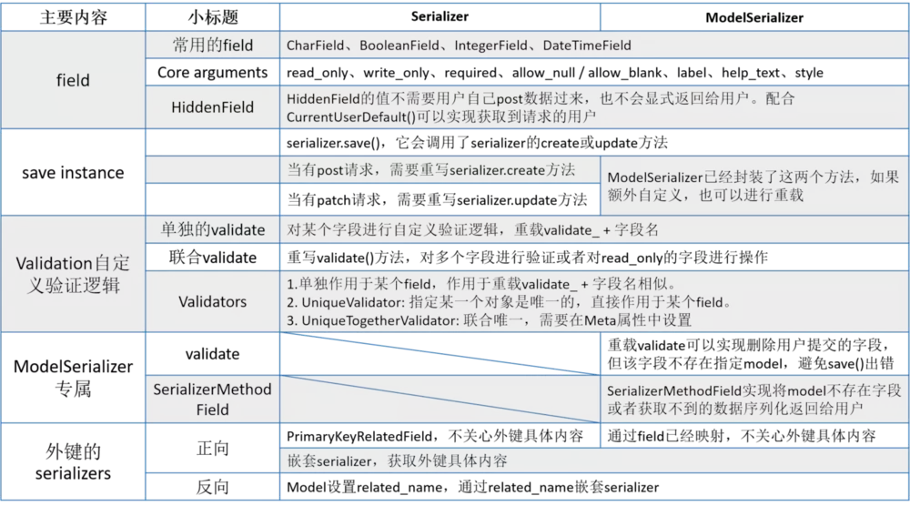

# django-rest-framework 使用
## drf生命周期
> 发送请求-->Django的wsgi-->中间件-->路由系统_执行CBV的as_view()，就是执行内部的dispath方法-->在执行dispath之前，有版本分析 和 渲染器-->在dispath内，对request封装-->版本-->认证-->权限-->限流-->视图-->如果视图用到缓存( request.data or   request.query_params )就用到了 解析器-->视图处理数据，用到了序列化(对数据进行序列化或验证) -->视图返回数据可以用到分页
## drf的使用
### 视图
View->views,APIView->generics.GenericAPIView->GenericViewSet
object->viewSetMixin->GenericViewSet
### mixins分类 (mixins)
|mixins|作用|对应请求|
|-----|-----|---|
|ListModelMixin|定义list方法，返回queryset列表|get|
|CreateModelMixin|定义create方法,创建一个实例|post|
|UpdateModelMixin|定义update方法，更新实例|put/patch|
|DestoryModelMixin|定义delete方法，删除某个实例|delete|
|RetriveModelMixin|定义retrieve方法，返回一个具体实例|get|
### 实验 （APIVIew）
```
from rest_framework.views import APIView
from rest_framework.response import Response
# 这个serializers是在其他文件自定义的
from .serializers import CourseSerializer

class CourseListView(APIView):
    def get(self, request, format=None):
        """
        通过APIView实现课程列表页
        """
        courses = Course.objects.all()
        serializer = CourseSerializer(courses, many=True)
        return Response(serializer.data)
```
调用了serializer和Response，APIView对View做了很多封装
### 实验 (GenericeAPIView)
```
from rest_framework import mixins
from rest_framework import generics
class CourseListView(mixins.ListModelMixin, generics.GenericAPIView):
    """
    课程列表页
    """
    queryset = Course.objects.all()
    serialize_class = CourseSerializer
    def get(self, request, *args, **kwargs):
    # list方法是存在于mixins中的，同理，create等等也是
    # GenericAPIView没有这些方法！
        return self.list(request, *args, **kwargs)
```
继承了mixins中ListModelMixin，在get()中，调用了他的list方法
list方法会返回queryset对json数据
#### GenericeAPIView特性
+ 加入queryset属性，可以直接设置这个属性，不必再将实例化的courses，再次传给seriliazer,系统会自动检测到。除此之外，可以重载get_queryset()，这样就不必设置'queryset=*'，这样就变得更加灵活，可以进行完全的自定义。
- 加入serializer_class属性与实现get_serializer_class()方法。两者的存在一个即可，通过这个，在返回时，不必去指定某个serilizer
+ 设置过滤器模板：filter_backends
- 设置分页模板：pagination_class
+ 暂不清楚lookup_field的作用
- 加入 lookup_field="pk"，以及实现了get_object方法:这个用得场景不多，但十分重要。它们两者的关系同上，要么设置属性，要么重载方法。它们的功能在于获取某一个实例时，指定传进来的后缀是什么。
### ViewSet
+ 重写了as.view()方法，可以获取到HTTP到请求方法
```
from rest_framework import viewsets
import...
class CourseViewSet(mixins.ListModelMixin, mixins.RetrieveModelMixin, viewsets.GenericViewSet):
    queryset = Course.objects.all()
    
    def get_serializer_class(self):
    # 重写get_serializer_class方法
        if self.action == 'list':
            return CourseSerializer
        return CourseDetailSerializer
```
```
# 进行绑定
courses = CourseViewSet.as_view({
    'get': 'list',
    'post': 'create'
})
urlpatterns = [
    ...
    # 常规加入url匹配项
    url(r'courses/', CourseViewSet.as_view(), name='courses')]
```
- 路由模式绑定 (route)
```
from rest_framework.routers import DefaultRouter
router = DefaultRouter() # 只需要实现一次
router.register(r'courses', CourseViewSet, base_name='courses')
urlpatterns = [
    ...
    # 只需要加入一次
    url(r'^', include(router.urls)),]
```

## Minxins
### CreateModelMixin
源码
```
# 源码
class CreateModelMixin(object):
    """
    Create a model instance ==>创建一个实例
    """
    def create(self, request, *args, **kwargs):
    
    # 获取相关serializer
        serializer = self.get_serializer(data=request.data)
        
        # 进行serializer的验证
        # raise_exception=True,一旦验证不通过，不再往下执行，直接引发异常
        serializer.is_valid(raise_exception=True)
        
        # 调用perform_create()方法，保存实例
        self.perform_create(serializer)
        
        headers = self.get_success_headers(serializer.data)
        return Response(serializer.data, status=status.HTTP_201_CREATED, headers=headers)

    def perform_create(self, serializer):
    # 保存实例
        serializer.save()

    def get_success_headers(self, data):
        try:
            return {'Location': str(data[api_settings.URL_FIELD_NAME])}
        except (TypeError, KeyError):
            return {}
```
> CreateModelMixin逻辑流程
post->获取相关serializer->进行数据验证（成功）->保存实例->Response->reseponse
post->获取相关serializer->进行数据验证（失败）->Exception->reseponse
```
CreateModelMixin
 + create(self, request):
    # 进行serializer验证
    # 调用self.perform_create进行数据保存
    # 获取self.get_success_headers返回信息头  
    # 返回请求
- perform_create(self, serializer):
    # 数据保存 默认serializer.save() ， 可如下扩展
        instance = serializer.save()
        course = instance.course
        course.fav_num += 1
        course.save()
+ get_success_headers(self, data):
    # 设置请求头  
```
### ListModelMixin
```
# 源码
class ListModelMixin(object):
    """
    List a queryset.==> 列表页获取
    """
    def list(self, request, *args, **kwargs):
        queryset = self.filter_queryset(self.get_queryset())

        # 这是一个分页功能，如果在viewset中设置了pagination_class，那么这里就会起作用
        # 获取当前页的queryset，如果不存在分页，返回None
        page = self.paginate_queryset(queryset)

        if page is not None:
        # 分页不为空，那么不能简单的执行Response(serializer.data)
        # 还需要将相关的page信息序列化在进行响应
            serializer = self.get_serializer(page, many=True)
            return self.get_paginated_response(serializer.data)

        serializer = self.get_serializer(queryset, many=True)
        return Response(serializer.data)
```
### RetriveModelMixin 
```
# 源码
class ListModelMixin(object):
    """
    List a queryset.==> 列表页获取
    """
    def list(self, request, *args, **kwargs):
        queryset = self.filter_queryset(self.get_queryset())

        # 这是一个分页功能，如果在viewset中设置了pagination_class，那么这里就会起作用
        # 获取当前页的queryset，如果不存在分页，返回None
        page = self.paginate_queryset(queryset)

        if page is not None:
        # 分页不为空，那么不能简单的执行Response(serializer.data)
        # 还需要将相关的page信息序列化在进行响应
            serializer = self.get_serializer(page, many=True)
            return self.get_paginated_response(serializer.data)

        serializer = self.get_serializer(queryset, many=True)
        return Response(serializer.data)
```
### UpdetaModelMixin
```
# 源码
class UpdateModelMixin(object):
    """
    Update a model instance.==> 更新某个具体对象的内容
    """
    def update(self, request, *args, **kwargs):
        partial = kwargs.pop('partial', False)
        instance = self.get_object()
        serializer = self.get_serializer(instance, data=request.data, partial=partial)
        serializer.is_valid(raise_exception=True)
        self.perform_update(serializer)

        if getattr(instance, '_prefetched_objects_cache', None):
            # If 'prefetch_related' has been applied to a queryset, we need to
            # forcibly invalidate the prefetch cache on the instance.
            instance._prefetched_objects_cache = {}

        return Response(serializer.data)

    def perform_update(self, serializer):
        serializer.save()

    def partial_update(self, request, *args, **kwargs):
        kwargs['partial'] = True
        return self.update(request, *args, **kwargs)
```
UpdateModelMixin的实现逻辑基本整合了Create以及Retrieve，先得到具体的实例，再对其进行验证以及保存，如果需要对更新这个逻辑进行自定义，那么需要重写perform_update( )方法，而尽量少去重写update()

### DestroyModelMixin
```
# 源码
class DestroyModelMixin(object):
    """
    Destroy a model instance.
    """
    def destroy(self, request, *args, **kwargs):
        instance = self.get_object()
        self.perform_destroy(instance)
        return Response(status=status.HTTP_204_NO_CONTENT)

    def perform_destroy(self, instance):
        instance.delete()
```
DestroyModelMixin的逻辑也相对比较简单，我们取CreateModelMixin下面的例子，当我们取消收藏，那么我们的DestroyModelMixin就发挥作用了。同理
```
def perform_create(self, serializer):
    instance = serializer.save()
    course = instance.course
    if course.fav_num > 0:
        course.fav_num -= 1
    else:
        course.fav_num = 0
    course.save()
```
### 小结
　　mixins相对比较好理解，本篇只是简要的分析了源码的内容以及各个mixins的逻辑，最重要的还是学会去重写它们相关的方法。 
　　一般情况下，当我们在操作某一个model的时候，涉及到另外一个model中数据的修改，那么就需要对这个mixins下执行save的逻辑的方法进行重写。

## Serializer
### 作用
+ 将querysey 与 model实例进行序列化，转成json
- 验证post/put 的数据
+ 处理post/put 的数据

### Save Instance
在mixins 中的post的create 和patch的 update中
在 perform_create 和perform_update 中都使用到了serializer.save()
> 流程(create)在保存数据阶段 ModelSerializer
保存实例->create()->perform_create()->serializers.save()
->调用create()->执行create()逻辑->intance.save()
```
# serializer.py
def save(self, **kwargs):
# 略去一些稍微无关的内容
    ···
    if self.instance is not None:
        self.instance = self.update(self.instance, validated_data)
            ···
    else:
        self.instance = self.create(validated_data)
            ···
    return self.instance
```
### Validation 自定义验证逻辑
单独的Validate
```
mobile_phone = serializers.CharField(max_length=11, min_length=11）

def validate_mobile_phone(self, mobile_phone):
    # 注意参数，self以及字段名
    # 注意函数名写法，validate_ + 字段名字
    if not re.match(REGEX_MOBILE, mobile):
    # REGEX_MOBILE表示手机的正则表达式
        raise serializers.ValidationError("手机号码非法")
    return mobile_phone
```
联合的Validate
```
 start = serializers.DateTimeField()
finish = serializers.DateTimeField()

def validate(self, attrs):
# 传进来什么参数，就返回什么参数，一般情况下用attrs
    if attrs['start'] > attrs['finish']:
        raise serializers.ValidationError("finish must occur after start")
    return attrs
可以在这给联合验证器下使用
    del attrs['name'] 删除不用保存的数据
```
Validator
```
def multiple_of_ten(value):
    if value % 10 != 0:
        raise serializers.ValidationError('Not a multiple of ten')

class GameRecord(serializers.Serializer):
    score = IntegerField(validators=[multiple_of_ten])
### 当然，drf提供的validators还有很好的功能：UniqueValidator，UniqueTogetherValidator等
### UniqueTogetherValidator: 联合唯一，如用户收藏某个课程，这个时候就不能单独作用于某个字段，我们在Meta中设置。
 class Meta:
    validators = [
        UniqueTogetherValidator(
            queryset=UserFav.objects.all(),
            fields=('user', 'course'),
            message='已经收藏'
        )]
```
### ModelSerializer
ModelSerializer在Meta中设置fields字段，系统会自动进行映射，省去每个字段再写一个field。
```
class UserDetailSerializer(serializers.ModelSerializer):
    """
    用户详情序列化
    """

    class Meta:
        model = User
        fields = ("name", "gender", "birthday", "email", "mobile")
        # fields = '__all__': 表示所有字段
        # exclude = ('add_time',):  除去指定的某些字段
        # 这三种方式，存在一个即可
```
#### ModelSerializer 需要解决的两个问题
+ 多余的字段（不保存数据库的）
```
在联合验证器中删除
def validate(self, attrs):
        del attrs["code"]
        return attrs
```
- 某个字段不属于指定model，它是read_only，只需要将它序列化传递给用户，但是在这个model中，没有这个字段！我们需要用到SerializerMethodField。
假设需要返回用户加入这个网站多久了，不可能维持这样加入的天数这样一个数据，一般会记录用户加入的时间点，然后当用户获取这个数据，我们再计算返回给它。
```
class UserSerializer(serializers.ModelSerializer):  
    days_since_joined = serializers.SerializerMethodField()
    # 方法写法：get_ + 字段
    def get_days_since_joined(self, obj):
    # obj指这个model的对象
        return (now() - obj.date_joined).days
        
    class Meta:
        model = User
```
### 关于外键的Serializers
假设现在有一门课python入门教学(course)，它的类别是python(catogory)。
```
ModelSerializer直接通过映射就可以获得的一个外键类别的id，但并不能获取到外键Model实例详细的信息，如果想要获取到具体信息，那需要嵌套serializer
category = CourseCategorySerializer()

以上外键都是正向取得，下面介绍怎么反向去取，如，我们需要获取python这个类别下有什么课程。首先，在课程course的model中，需要在外键中设置related_name：
class Course(model.Model):
    category = models.ForeignKey(CourseCategory, related_name='courses')

# 反向取课程，通过related_name
# 一对多，一个类别下有多个课程，一定要设定many=True
courses = CourseSerializer(many=True)
```